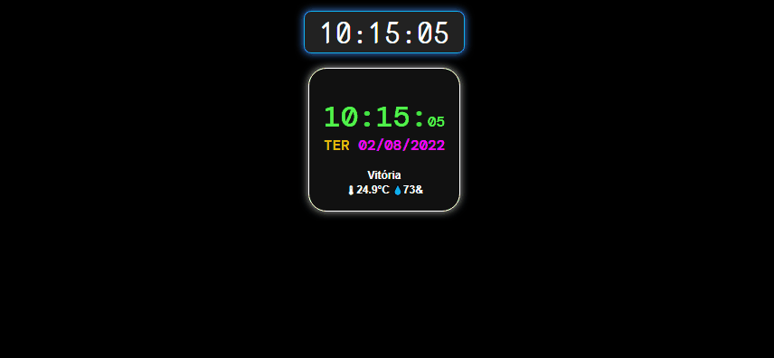
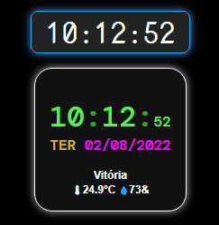

# Relogio-Digital-Smart

Relógio Smart consumindo API - temperatura e umidade relativa da cidade de Vitória-ES.

<i>"Seja bem-vindo" </i> 

  <kbd>
    
  </kbd>
  &nbsp;&nbsp;&nbsp;&nbsp;
  <kbd> 
    
  </kbd>
  &nbsp;&nbsp;&nbsp;&nbsp;

## Tecnologias utilizadas
- HTML
- CSS
- JAVASCRIPT
   

Made with 💙 by Gustavo Mattos 👋 [See my LinkedIn](https://www.linkedin.com/in/guh-mattos/)
